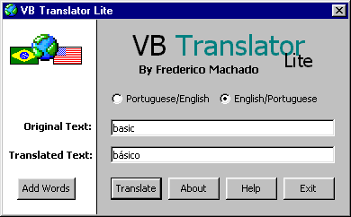

<div align="center">

## VB Translator UPDATE


</div>

### Description

This is an example of as we can use a database to keep words of two languages. VB Translator translates from Portuguese(Brazil) to English and from English to Portuguese(Brazil) a word per time.

NOW YOU CAN ADD WORDS TO THE TRANSLATOR.

THE CODE IS VERY COMENTED.

VOTE FOR ME PLEASEEEEE... :) LEAVE A FEEDBACK!!!
 
### More Info
 


<span>             |<span>
---                |---
**Submitted On**   |2001-09-08 23:16:22
**By**             |[Frederico Machado](https://github.com/Planet-Source-Code/PSCIndex/blob/master/ByAuthor/frederico-machado.md)
**Level**          |Beginner
**User Rating**    |4.8 (53 globes from 11 users)
**Compatibility**  |VB 6\.0
**Category**       |[Miscellaneous](https://github.com/Planet-Source-Code/PSCIndex/blob/master/ByCategory/miscellaneous__1-1.md)
**World**          |[Visual Basic](https://github.com/Planet-Source-Code/PSCIndex/blob/master/ByWorld/visual-basic.md)
**Archive File**   |[VB Transla26150982001\.zip](https://github.com/Planet-Source-Code/frederico-machado-vb-translator-update__1-27087/archive/master.zip)

### API Declarations

```
'*******************************
'*
'* VOTE FOR ME IF YOU LIKE IT
'*
'*******************************
```


